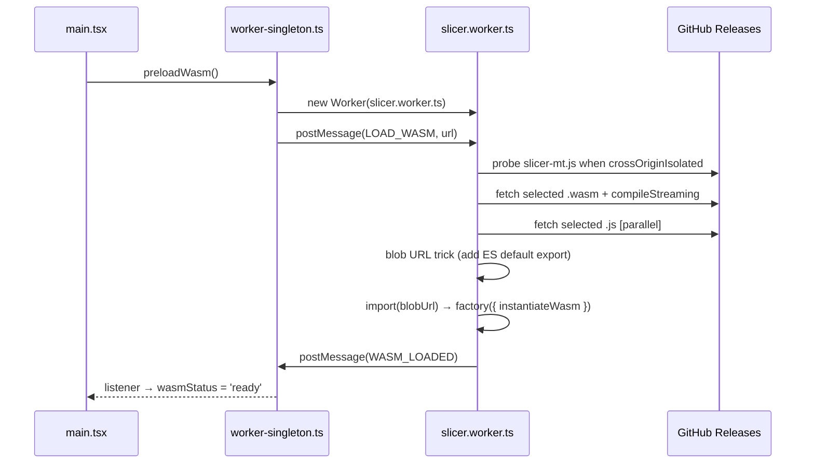

# Architecture

## Project vision

The main product of this repository is the **WASM slicer engine** — OrcaSlicer compiled to WebAssembly with full feature parity (fuzzy skin, infill, supports, all slicer parameters). The goal is a fully working OrcaSlicer that runs without a native binary, embeddable in any environment that can execute WASM. A Node CLI wrapper existed early on and was deliberately removed (`chore: remove CLI` — frontend → bridge → engine only); it is not a project goal.

The React web UI is a temporary proof-of-concept to demonstrate the engine. It is not the end goal and is not the primary focus of development effort.

## System diagram

```
┌─────────────────────────────────────────────────────────┐
│                       Browser                            │
│                                                          │
│   main thread                                            │
│   ┌────────────────────────────────────────────────┐    │
│   │  React 19 + TypeScript + Tailwind CSS v4        │    │
│   │                                                │    │
│   │  App.tsx            layout, tabs, settings     │    │
│   │  ├── FileUpload     drag & drop STL/3MF/STEP/OBJ│    │
│   │  ├── ModelViewer    Three.js, real mm scale    │    │
│   │  ├── SettingsPanel  presets + profile-set import│    │
│   │  ├── GcodeViewer    toolpaths, layer slider    │    │
│   │  └── SliceCards     SliceHeader, QueueItemCard,│    │
│   │       PlateResultCard, ConfigSummary           │    │
│   │                                                │    │
│   │  hooks/useSliceQueue.ts (queue state machine:  │    │
│   │    reducer + worker protocol + cancel/stale +  │    │
│   │    engine progress)                            │    │
│   │  worker-singleton.ts (module-level singleton)  │    │
│   └──────────────────┬─────────────────────────────┘    │
│                      │ postMessage (ArrayBuffer)         │
│   ┌──────────────────▼─────────────────────────────┐    │
│   │  Web Worker: slicer.worker.ts                  │    │
│   │  └── wasm-loader.ts                            │    │
│   │      ├── _orc_session_create/destroy()          │    │
│   │      ├── _orc_init(session, configJson)         │    │
│   │      ├── _orc_slice(session, stl) → gcode       │    │
│   │      │   + SLICE_PROGRESS { percent, stage }    │    │
│   │      ├── _orc_slice_multi(session, stls,        │    │
│   │      │       extruderIds) → gcode string        │    │
│   │      ├── _orc_prepare_plate(session, stls,     │    │
│   │      │       operation) → transforms            │    │
│   │      ├── _orc_obj_to_stl(obj) → stl bytes      │    │
│   │      └── _orc_cad_to_stl(step) → stl bytes     │    │
│   └──────────────────┬─────────────────────────────┘    │
│                      │ fetch                             │
│   ┌──────────────────▼─────────────────────────────┐    │
│   │  GitHub Releases: MT + ST fallback             │    │
│   │  ├── slicer-mt.js  ~250 KB (MT glue)           │    │
│   │  ├── slicer-mt.wasm ~37 MB (MT primary)        │    │
│   │  ├── slicer.js     ~220 KB (ST glue)           │    │
│   │  └── slicer.wasm   ~38 MB (ST fallback)        │    │
│   │     (both include OCCT for STEP)               │    │
│   └────────────────────────────────────────────────┘    │
└─────────────────────────────────────────────────────────┘
```

No `slicer.data` — the headless flat-config slicer never reads `orca/resources` at runtime, so the 200 MB preload file was eliminated entirely.

## WASM loading sequence



The selected `.wasm` file is compiled with `WebAssembly.compileStreaming` while
it downloads (and while the matching `.js` glue is still being fetched),
overlapping download and compilation; the compiled module is handed to Emscripten through the
`instantiateWasm` hook. When the server mislabels the Content-Type the worker
falls back to buffered `WebAssembly.compile`.

Total cold MT load is ~37 MB; the ST fallback is ~38 MB (down from ~152 MB with
the old v2.3.1 + `slicer.data` engine). The current size comes from OCCT being
compiled directly into the selected WASM binary — no separate download, no
extra WASM file, no third-party dependency.

## Blob URL trick

Emscripten compiles OrcaSlicer to a CommonJS IIFE (`var OrcaModule = ...`), not an ES module. The worker needs to `import()` it dynamically:

```typescript
const jsText = await fetch(url).then(r => r.text())
const blob = new Blob(
  [`${jsText}\nexport default OrcaModule;`],
  { type: 'application/javascript' },
)
const { default: factory } = await import(URL.createObjectURL(blob))
```

## Singleton worker pattern

React StrictMode mounts components twice in development, which would create two workers and trigger two downloads. The solution: a module-level singleton in `worker-singleton.ts`.

```typescript
let worker: Worker | null = null

export function getWorker(): Worker {
  if (worker) return worker
  worker = new Worker(...)
  worker.postMessage({ type: 'LOAD_WASM', url: wasmUrl })
  return worker
}
```

`preloadWasm()` is called in `main.tsx` before React renders, so WASM loading starts immediately.

## Engine clean layer (override approach)

OrcaSlicer C++ source is never modified. The WASM build uses a three-layer strategy to strip out dependencies that are unavailable in a browser:

| Layer | Location | Purpose |
|-------|----------|---------|
| Header shims | `orca-wasm/wasm/shims/` | Replace system library headers (TBB, OpenVDB, FreeType, OpenSSL) with minimal stubs so the compiler sees the right types |
| C++ override stubs | `orca-wasm/overrides/` | Replace OrcaSlicer `.cpp`/`.hpp` files whose implementation depends on missing libraries |
| In-place patches | `orca-wasm/patches/apply.py` | Fix C++ compatibility issues in OrcaSlicer source (narrowing, ABI, platform guards) |

`apply.py` runs before `cmake` and is idempotent. CI applies all three layers automatically.

### Header shims (`orca-wasm/wasm/shims/`)

Added to the compiler search path before all other include paths (`BEFORE PUBLIC` in CMake), so these stubs shadow the real system headers.

#### TBB — sequential stubs (ST engine)

This section describes the single-threaded (ST) engine build, which is what GitHub Pages always serves and what the Cloudflare mirror falls back to. Every TBB parallel algorithm is replaced by a sequential equivalent that runs in the same thread. A separate multithreaded (MT) build links real oneTBB instead of these stubs and is served only where cross-origin isolation is available — see [ADR-011](adr/adr-011-multithreaded-engine.md).

| Shim | Sequential equivalent |
|------|-----------------------|
| `tbb/parallel_for.h` | plain `for` loop |
| `tbb/parallel_for_each.h` | `std::for_each` |
| `tbb/parallel_reduce.h` | sequential iterate + merge |
| `tbb/parallel_invoke.h` | call each functor in order |
| `tbb/parallel_pipeline.h` | sequential `flow_control` / `filter_t` / `make_filter` pipeline |
| `tbb/task_arena.h` | `max_concurrency()` → 1; `execute()` calls functor directly |
| `tbb/task_group.h` | `run()` calls functor immediately; `wait()` is a no-op |
| `tbb/spin_mutex.h` | no-op mutex (single-threaded — no contention possible) |
| `tbb/partitioner.h` | empty `simple/auto/static/affinity_partitioner` types |
| `tbb/global_control.h` | no-op |
| `tbb/concurrent_vector.h` | alias for `std::vector` |
| `tbb/concurrent_unordered_map.h` | alias for `std::unordered_map` |
| `tbb/concurrent_unordered_set.h` | alias for `std::unordered_set` |
| `tbb/blocked_range.h` + `blocked_range2d.h` | lightweight range containers |
| `tbb/tbb.h` | umbrella include — pulls in all of the above |
| `tbb/version.h` | version constants |
| `oneapi/tbb/…` | re-exports → `tbb/…` (same headers, dual include path; also includes `scalable_allocator.h`) |

#### OpenVDB — minimal type stub

`openvdb/openvdb.h` defines only the types referenced by OrcaSlicer headers: `Index32`, `Index64`, `math::Transform`, `initialize()`, and the `math`/`tools`/`util` sub-namespaces. No linking to libopenvdb is needed because the `.cpp` files that would use it are replaced by overrides (see below).

#### FreeType — minimal type stub

`ft2build.h` + `freetype/*.h` provide the types and constants required by `Shape/TextShape.hpp`. The stub is needed because `TextShape.cpp` is compiled as a no-op override and the compiler still needs to parse its header.

#### OpenSSL MD5 — minimal stub

`openssl/md5.h` — minimal stub; MD5 is not used on the FDM slicing path. Emscripten does not bundle OpenSSL.

### C++ override stubs (`orca-wasm/overrides/`)

These replace OrcaSlicer `.cpp` (and some `.hpp`) files whose implementation depends on a library unavailable in WASM. The original files are excluded from compilation; the overrides are compiled in their place. Override `.hpp` headers are physically copied into the OrcaSlicer source tree at CI time so that `#include` from neighbouring files resolves to the stub.

| Override file | Replaces | Missing library | What the stub does |
|--------------|----------|-----------------|--------------------|
| `Format/DRC.cpp` | Draco mesh import | **Draco** | Empty no-op |
| `Format/svg.cpp` | SVG export | **OCCT** | Empty no-op (SVG export feature unused; not wired to the in-engine OCCT) |
| `OpenVDBUtils.cpp` + `OpenVDBUtils.hpp` | VDB volume operations used by FDM infill | **OpenVDB** | Empty header; empty `.cpp` |
| `SLA/Hollowing.cpp` | SLA model hollowing | **OpenVDB** | Empty no-op (SLA not used) |
| `ObjColorUtils.cpp` + `ObjColorUtils.hpp` | OBJ colour calibration | **OpenCV** | Empty header; empty `.cpp` |
| `Shape/TextShape.cpp` | 3D text extrusion | **FreeType** + **OCCT** | Empty no-op |

!!! note "STEP support — in-engine OCCT"
    OCCT (Open CASCADE Technology 7.8.1) is compiled directly into `slicer.wasm` as part of the dependency build (see `.github/workflows/build-wasm.yml`'s "Build WASM deps — OCCT" step, or `orca-wasm/scripts/build-local-wsl.sh` for local builds). The engine exposes `_orc_cad_to_stl()` which reads a STEP file from MEMFS via OrcaSlicer's `Model::read_from_step()` (which runs `Step::load()` + `Step::mesh()` under the hood), tessellates the BRep geometry, and returns binary STL bytes.

    - **Browser**: `CAD_TO_STL` message is sent to the slicer worker; the worker calls `_orc_cad_to_stl()` and replies with `CAD_STL_COMPLETE { stl }`.

    No separate OCCT WASM download or third-party library is required.

    **IGES is not supported** — OrcaSlicer's STEP reader (`STEPCAFControl_Reader`) does not read IGES, so `.iges`/`.igs` are not accepted by the UI.

### Boost.Log — disabled at runtime

The logging core is disabled outright (`boost::log::core::get()->set_logging_enabled(false)`) by a static initializer in `orca-wasm/bridge/slicer.cpp`. No sink is ever registered in this headless build (the file sink in `utils.cpp` requires `set_logging_file()`, which only the desktop CLI calls), so any record passing the default `warning` filter went to Boost.Log's *default* sink — which, under this single-threaded (`BOOST_LOG_NO_THREADS`) Emscripten build, non-deterministically traps with "memory access out of bounds" in `core::push_record_move()` and is extremely slow. This bit twice: the `nozzle_info.json` incident (a single `BOOST_LOG_TRIVIAL(error)` trapped every slice), and the Voron Design Cube hang — Arachne's per-edge warning storm during Voronoi-diagram repair either trapped mid-slice or spent most of the slice's CPU formatting log records nobody could see, turning a multi-second slice into a multi-minute-plus one.

### libnoise

libnoise (Perlin / Billow / RidgedMulti / Voronoi noise) **is** compiled into the WASM engine and linked normally. `Feature/FuzzySkin/FuzzySkin.cpp` is not stubbed — it is patched in-place by `apply.py`: `thread_local` storage (unsupported by Emscripten in single-threaded mode) is rewritten to `static`, and the seed-fallback expression `std::hash<std::thread::id>()(std::this_thread::get_id())` is replaced with `rd()` (the `std::random_device` already in scope). Fuzzy skin effect is therefore **active** in the engine when `fuzzy_skin ≠ none`.

### Upgrading OrcaSlicer version

Change `ORCA_VERSION` in `build-wasm.yml` and re-run CI. Only changes to the signatures of overridden functions require stub updates.

### Session-scoped engine state

`orca-wasm/bridge/slicer.cpp` scopes the active config, bed geometry, and last
error behind an opaque `orc_session_create()`/`orc_session_destroy()` handle
rather than process-wide C++ statics — see [ADR-008](adr/adr-008-session-handle.md).
`slicer.worker.ts` creates one session right after the module loads and reuses
it for the worker's entire lifetime, so this is behaviour-equivalent to the
old global-state bridge today; it only removes the structural blocker to a
future caller (Node CLI, worker pool) holding more than one session safely in
the same WASM instance.

### Worker crash recovery

If the WASM module aborts at runtime (an unreachable trap, OOM), `onAbort`
reports a `WASM_ERROR` to the main thread and the worker refuses further work
instead of calling into the dead module. `worker-singleton.ts` terminates and
drops that worker on any `WASM_ERROR` (load failure or runtime crash alike);
the next `getWorker()` call spawns a fresh worker and reloads the engine from
scratch, so a mid-session crash is recoverable without a full page reload.
On `WASM_ERROR` the queue (`useSliceQueue`) fails every in-flight item —
the current slice, queued OBJ/STEP conversions, and a running plate slice —
so nothing is left spinning on work the dead worker can no longer deliver.

### Slice queue state machine

`src/hooks/useSliceQueue.ts` owns all queue/slicing state in a single
`useReducer` state machine. Worker responses are correlated explicitly: each
OBJ/STEP conversion carries a `requestId` (the queue item id) echoed back on
the matching `*_COMPLETE`/`*_ERROR`, and single slices are gated by a
`currentId` so only one `SLICE` is ever in flight. A `configEpoch` counter
marks finished results **stale** when the settings change after they were
sliced — the UI flags them and the Slice button becomes *Re-slice*.
User-initiated **cancel** terminates the worker (the synchronous WASM slice
loop cannot be interrupted any other way), re-posts any queued conversions
from their retained source `File`s to the fresh worker, and lets the engine
reload lazily on the next request.

### WASM build smoke test

`build-wasm.yml` runs `orca-wasm/scripts/smoke-test.mjs` after packaging and
before publishing a release — real `orc_init`/`orc_slice(_multi)` calls against
the freshly built engine, not just a successful compile. See
[ADR-009](adr/adr-009-wasm-smoke-test.md).

### E2E UI smoke test

`.github/workflows/e2e-smoke.yml` runs a Playwright test (`e2e/slice.spec.ts`)
against the real UI on every PR: upload the real Voron Design Cube v7 STL
(`e2e/fixtures/voron-design-cube-v7.stl`, vendored under GPL-3.0 — see
`NOTICE.md` — the same model that historically triggered two production
crashes in the Arachne wall generator), slice it through the actual
`FileUpload` → worker → WASM path, and assert the result reaches `Done`.
Downloads the latest *published* engine release rather than building one,
since engine-source correctness is already gated by the WASM build smoke
test above. See [ADR-010](adr/adr-010-e2e-smoke-test.md).

## Coordinate systems

Both viewers use a **Z-up** scene to match the slicer engine — G-code axes map directly to Three.js axes with no permutation.

| | G-code | Three.js | In app |
|---|---|---|---|
| Horizontal 1 | X | X | X |
| Horizontal 2 | Y | Y | Y |
| Vertical | Z | Z | Z (up) |

**ModelViewer** positions the STL with its bottom face at Z=0, centered on X/Y.

**GcodeViewer** sends G-code to its dedicated `gcode-parser.worker.ts` (separate from the slicer worker), which returns typed-array buffers as transferables so large previews never parse on the UI thread. It parses G1 extrusion moves and G0/G1 travel moves, computes centroid of all X/Y toolpath points, subtracts it, and uses G-code axes directly (`gcodeX → x`, `gcodeY → y`, `gcodeZ → z`). Reads OrcaSlicer `;TYPE:` comments to colour extrusion segments by feature type; falls back to a blue→orange height gradient. All extrusion segments are merged into one `LineSegments2` geometry and all travels into one `LineSegments` geometry; the layer slider adjusts their draw ranges, preserving two draw calls irrespective of layer count.

## Data flow

```
File drop
  │
  ├─ .stl ──────────► File state
  │                       │
  │               ModelViewer (Three.js STLLoader)
  │
  ├─ .3mf ───────────► worker.postMessage(READ_3MF, mf bytes, requestId)
  │                       │
  │               [worker] _orc_read_3mf() [OrcaSlicer's own reader —
  │                        ModelObject::mesh() bakes in instance/volume
  │                        transforms; config JSON re-parsed by the existing
  │                        parseOrcaProfileJson()]
  │                       │
  │               READ_3MF_COMPLETE { stl, configJson }
  │                       ├─► onSettingsImported(patch, filename)
  │                       └─► synthetic .stl File → File state
  │                  (on engine failure: item marked 'error' — no JS-side
  │                   fallback parser)
  │
  ├─ .step / .stp ──► worker.postMessage(CAD_TO_STL, cad bytes)
  │                       │
  │               [worker] _orc_cad_to_stl() [OCCT in-engine]
  │                       │
  │               CAD_STL_COMPLETE { stl }
  │                       └─► synthetic .stl File → File state
  │
  └─ .obj ──────────► worker.postMessage(OBJ_TO_STL, obj bytes)
                           │
                   [worker] _orc_obj_to_stl()
                           │
                   OBJ_STL_COMPLETE { stl }
                           └─► synthetic .stl File → File state

  │ config = resolveConfig({ preset, imported, manual })  [see below]
  │
  ├─ Sequential mode (one G-code per file)
  │  handleSliceAll() → startNextSlice() for each ready item
  │      │
  │      └─► worker.postMessage(SLICE, stl, config)
  │               │
  │          SLICE_PROGRESS { percent, stage } → current item UI
  │          SLICE_COMPLETE { gcode }  →  item.status = 'done'
  │          startNextSlice() continues queue
  │
  └─ Plate mode (all files → one G-code)
     handleSlicePlate() → reads all ready stlFiles
         │
         └─► worker.postMessage(SLICE_MULTI, stls[], config)
                  │
             [worker] concatenate + build int32 offset table
                  │
             _orc_slice_multi() → arrange_objects() + slice
             SLICE_PROGRESS { percent, stage } → plate UI
                  │
             SLICE_MULTI_COMPLETE { gcode }
                  │
         plateGcode → PlateResultCard (eye / download)
                  │
          ┌───────┴────────┐
          ▼                ▼
    ModelViewer       GcodeViewer
 (STL, white bg)  (toolpaths, dark bg)

  └─ Export .3mf (per queue item, on a done card)
     export3mf(item) → worker.postMessage(WRITE_3MF, stl, config, requestId)
         │
    [worker] _orc_write_3mf(session, stl) — reuses OrcSession::config
    (the same flat DynamicPrintConfig ADR-005 describes) via
    Slic3r::store_bbs_3mf(); no PartPlateList in this headless bridge, so
    plate/gcode/thumbnail data is intentionally omitted (mesh + config only)
         │
    WRITE_3MF_COMPLETE { data } → downloadBlob(item.name + '.3mf')
```

### Config layers

The `config` handed to every slice is resolved from three layers, lowest priority first — `preset` (printer + filament + quality selection), `imported` (settings from a loaded `.3mf` or `.json` profile/profile set), `manual` (fields the user edited in the panel). `src/lib/config-layers.ts` owns that order and is the only place it may change; `App.tsx` holds one piece of state per layer and merges them through `resolveConfig()`.

The invariant worth guarding in review: **changing a lower layer must never clear a higher one.** Swapping a compatible preset or importing a profile replaces only its own layer — the manual layer is dropped solely by an explicit per-field revert, "Reset all", or loading a saved user preset (which is by definition a complete selection). A complete imported machine/profile-set/3MF context is the deliberate exception: changing the printer or, for a complete set, its material list removes that imported context before the new selection is rendered, so the UI cannot claim one machine while the engine receives another one's vectors. Every one of those handlers used to call `setManualOverrides({})`, which silently discarded the user's edits; the quality chips fire even when the already-selected one is clicked, so it could happen with no visible change at all. `src/lib/config-layers.test.ts` pins the precedence, including that a manual `0` is kept rather than falling through.

The panel marks manual fields with an amber outline and a revert control, mirroring desktop OrcaSlicer's modified-setting flag. User-facing description: [Settings precedence](profiles.md#settings-precedence).

One asymmetry sits downstream: the worker applies `_passthrough` (unmapped fields from an imported profile) *after* the mapped config on the way to `orc_init`. That doesn't invert the order, because `parseOrcaProfileJson` only routes a field to `_passthrough` when it is *not* one of the mapped fields the panel can edit — the two sets are disjoint. Adding a panel control for a passthrough-only field would break that assumption and require revisiting the worker's merge order.

### Local OrcaSlicer profile-set import

`SettingsPanel` reads all selected local JSON files, parses them through
`parseOrcaProfileJson()`, and calls the pure
`mergeImportedProfileFiles()` reducer before notifying `App`. The reducer
rejects duplicate machine/process/print categories, orders known filament types
deterministically, preserves OrcaSlicer's multi-value vectors in `_passthrough`,
and adds inferred `filament_type`/`filament_settings_id` values for leaf files
that omit them. The state update is one imported layer, so a parse or merge
failure cannot leave a half-applied selection.

`withFilamentSlots()` then combines the imported vectors with the UI's material
selection. The number of physical nozzles comes from the imported
`nozzle_diameter` vector; slots are assigned round-robin through `filament_map`
(`1`, `2` for PLA/PETG on a two-nozzle machine), while imported per-slot
temperatures, flow, and G-code remain authoritative when the picker names the
same material. There is deliberately no GitHub-auth or printer-upload path in
this flow: the worker's production boundary is local slicing and G-code
download. A change to the material list clears a complete imported set before
the new slot list is resolved, preventing fixed-length per-filament vectors
from being reused for a different material selection.

Engine-side 3MF write + read (`orc_write_3mf` / `orc_read_3mf`, issue #108) are the first bridge functions to touch `libslic3r/Format/bbs_3mf.hpp` — previously 3MF only flowed one way, parsed client-side by the now-removed `parse3mf.ts`. `orc_write_3mf` is a plain request/response through the worker (like `OBJ_TO_STL`/`CAD_TO_STL`), not part of the slice queue's state machine, since exporting doesn't change `item.status`. `orc_read_3mf` *is* part of the file-drop pipeline (same shape as `OBJ_TO_STL`/`CAD_TO_STL`'s conversion step); a failed engine read now marks the queue item `'error'` rather than falling back to a JS parser — `orc_read_3mf` resolves multi-object transforms the way OrcaSlicer itself does, which the JS walker couldn't, so a fallback would have silently produced worse geometry rather than a clear failure. Not scoped: a full "sliced project" 3MF (per-plate G-code, thumbnails) — this headless bridge has no `PartPlateList` to source that from; see `status.md`'s "Nie zaimplementowane" section.

## Build & deploy

=== "Local dev"
    ```bash
    npm run dev       # Vite dev server, WASM from /wasm/
    ```

=== "Production (GitHub Pages)"
    ```bash
    # Triggered automatically on push to master
    # deploy.yml resolves the highest release in the wasm-v2.4.2 /
    # wasm-v2.4.2-patchN family for slicer.js + slicer.wasm (ST), and
    # the highest sibling wasm-v2.4.2-patchN-multithreaded release
    # for slicer-mt.* (MT)
    # (best-effort — a missing MT release
    # never fails the deploy), and embeds both in the gh-pages branch under
    # app/wasm/. GitHub Pages cannot send custom response headers, so it can
    # never be crossOriginIsolated — the app always selects the ST engine
    # here regardless of which files are present (see ADR-011).
    ```

=== "PR snapshots (GitHub Pages)"
    ```bash
    # pr-preview.yml runs for PRs whose source branch is in this repository.
    # Each push builds the UI into previews/pr-<number>/ on gh-pages and posts
    # the URL on the PR. It reuses app/wasm/ from production, so snapshots do
    # not publish another large WASM binary. Closing the PR removes the files.
    # Fork PRs intentionally do not receive a snapshot: untrusted PR code is
    # never run with credentials that can write to gh-pages.
    ```

=== "Mirror (Cloudflare Workers)"
    ```bash
    # Cloudflare Workers Builds (Git integration), on push to master
    # Build command:  npm run build:cf   (scripts/cf-build.mjs)
    # Deploy command: npx wrangler deploy   (wrangler.jsonc, static assets)
    #
    # This builds independently of deploy.yml, off the same master pushes —
    # including deploy.yml's own auto-bump commit, so the version label here
    # matches GitHub Pages. That commit is marked [skip actions] rather than
    # [skip ci] specifically because Workers Builds honors [skip ci] as well:
    # with the old marker the mirror only ever rebuilt merge commits and sat
    # permanently one patch version behind (identical code, stale label).
    # See the comment on deploy.yml's "Auto-bump app version" step.
    #
    # public/_headers sends Cross-Origin-Opener-Policy: same-origin +
    # Cross-Origin-Embedder-Policy: require-corp on every response here —
    # the one host in this deployment that's crossOriginIsolated, so it's
    # the only place the real multithreaded (MT) engine actually runs
    # (see ADR-011).
    #
    # Cloudflare serves only the app shell: slicer.wasm (~38 MB) and
    # slicer-mt.wasm (~37 MB) both exceed the 25 MiB per-asset limit, so
    # cf-build.mjs sets VITE_WASM_BASE_URL to the GitHub Pages copies
    # (served with Access-Control-Allow-Origin: * and Content-Type:
    # application/wasm — required for COEP to allow the cross-origin fetch
    # at all; plain GitHub Releases assets send neither header and can't be
    # read this way) and the app loads whichever engine it needs
    # cross-origin. The GitHub Pages deploy therefore remains the source of
    # truth for both engine binaries — a Cloudflare-only deploy cannot ship
    # a new engine.
    #
    # slicer.worker.ts probes for slicer-mt.js before committing to it and
    # falls back to the always-present ST engine on any failure, so a
    # missing/stale MT mirror degrades gracefully rather than breaking the
    # app.
    #
    # Cache key + header label ultimately come from app/wasm/engine-version.json.
    # cf-build.mjs still bakes a value at build time (fallbacks: GitHub Releases
    # API, then the app version) — but that is now only a FALLBACK: the worker
    # (slicer.worker.ts) re-reads engine-version.json at RUNTIME on every load
    # and uses that for the ?v= cache-buster + header. This decouples the app
    # shell from the engine version: because the CF shell build (~2 min) races
    # the multi-hour Build WASM, the shell used to bake a stale engine version
    # and pin the CacheFirst cache to an old (possibly deadlocking) binary until
    # the next shell rebuild. Runtime resolution means the shell always tracks
    # whatever engine gh-pages currently serves, with no CF rebuild needed for
    # an engine-only update. (engine-version.json is deliberately not SW-cached.)
    ```

=== "Build WASM engine"
    ```bash
    # GitHub Actions → Build WASM → Run workflow
    # Manual dispatch: enter the upstream OrcaSlicer tag, e.g. v2.4.2
    # Builds two matrix legs (variant: [st, mt]):
    #   st: slicer.js (~220 KB) + slicer.wasm (~38 MB) — sequential TBB
    #       stubs (ADR-007), unchanged.
    #   mt: slicer-mt.js + slicer-mt.wasm (~37 MB) — real oneTBB built from
    #       source, linked with Emscripten pthreads (ADR-011).
    # Each leg runs orca-wasm/scripts/smoke-test.mjs before publishing
    # (ADR-009) — a build that fails the smoke test never reaches the
    # release step. A compare-outputs job then slices both variants'
    # outputs and requires matching G-code structure.
    # Current published targets are wasm-v2.4.2-patch12 (st) and
    # wasm-v2.4.2-patch13-multithreaded (mt); future builds use the
    # highest immutable patch in each family.
    ```

## Stack

| Layer | Technology | Notes |
|-------|-----------|-------|
| UI | React 19, TypeScript 6 | No React Router — single-page tab state |
| Styling | Tailwind CSS v4 | Custom `orca-*` colour scale |
| 3D | Three.js 0.184 | STLLoader, OrbitControls, LineSegments2 (fat lines) |
| Bundler | Vite 8 | Worker ES format, configurable base |
| WASM | OrcaSlicer **v2.4.2** | Emscripten, self-built; real-oneTBB multithreaded (MT) engine is primary on the cross-origin-isolated product host, with single-threaded (ST) fallback elsewhere (see ADR-011) |
| Worker | Web Worker (ES module) | Blob URL for dynamic import |
| License | AGPL-3.0-or-later | Source link in UI footer per §13 |
